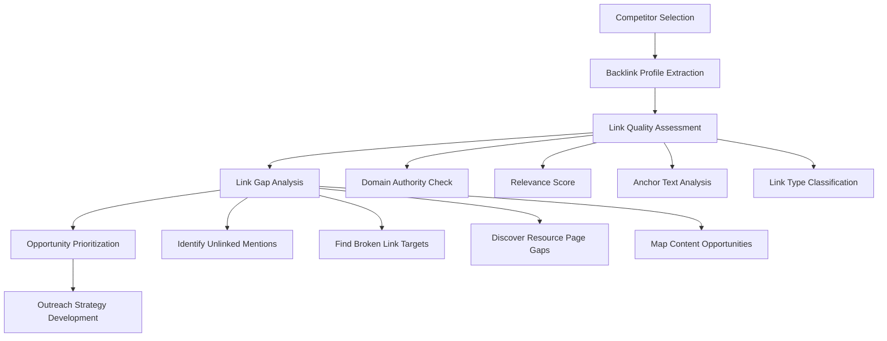
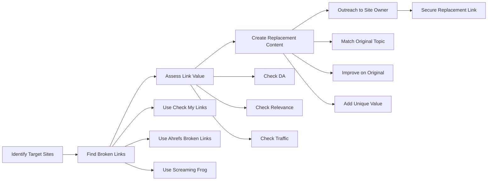
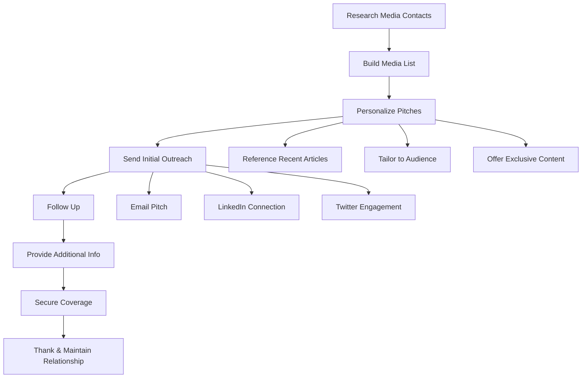

# Link-Building Strategy for LynkSkill

**Document Version:** 1.0  
**Date:** January 23, 2026  
**Platform:** LynkSkill (https://lynkskill.net)  
**Status:** Strategic Planning Document

---

## Executive Summary

This comprehensive link-building strategy addresses the critical need to increase domain authority, improve search rankings, and drive relevant traffic to LynkSkill. Building upon the on-page content optimization work, this strategy focuses on acquiring high-quality, white-hat backlinks from authoritative sources in education, career development, and Bulgarian business ecosystems.

**Key Priorities:**

1. **Educational Institution Links** - Secure partnerships with Bulgarian universities for authoritative .edu/.bg links
2. **Content Marketing Assets** - Create linkable assets that naturally attract backlinks
3. **Local Business Directory Links** - Establish presence in Bulgaria-specific business directories
4. **Industry Association Links** - Build relationships with IT, marketing, and design associations
5. **Digital PR & Media Coverage** - Secure press mentions and features in Bulgarian tech publications

**Expected Impact:**

- **Domain Authority (DA) Increase:** From current baseline to 30-40 within 12 months
- **Organic Traffic Growth:** 200-300% increase through improved search rankings
- **Referral Traffic:** 50-100 new referring domains from relevant sources
- **Brand Visibility:** Increased presence in Bulgarian education and career ecosystems
- **Lead Generation:** Higher quality traffic from targeted sources

**Strategic Approach:**

This strategy emphasizes white-hat, sustainable link-building techniques that align with Google's quality guidelines. We focus on relationship building, content value creation, and genuine partnerships rather than manipulative tactics. The approach is phased, allowing for resource optimization and measurable progress tracking.

---

## 1. Competitor Link Analysis Framework

### 1.1 Primary Competitors to Monitor

| Competitor | Domain | Primary Focus | Estimated DA | Link Sources |
|------------|--------|--------------|--------------|--------------|
| Jobs.bg | jobs.bg | General job board | 45-55 | Company listings, partner sites, directories |
| Zaplata.bg | zaplata.bg | Salary & job portal | 40-50 | Company profiles, salary data citations |
| Dev.bg | dev.bg | IT job board | 35-45 | Tech blogs, company sites, GitHub projects |
| LinkedIn | linkedin.com | Global professional network | 95-100 | Company profiles, user content, integrations |
| Indeed | indeed.com | Global job search | 90-95 | Company sites, job widgets, API integrations |

### 1.2 Analysis Tools & Methodology

**Primary Tools:**

1. **Ahrefs** - Comprehensive backlink analysis, competitor research, link gap identification
2. **SEMrush** - Backlink audit, competitor link tracking, toxic link detection
3. **Moz Link Explorer** - Domain Authority tracking, link opportunity discovery
4. **Google Search Console** - Monitor own backlink profile, disavow toxic links
5. **Screaming Frog** - Identify broken link opportunities on target sites

**Analysis Framework:**



### 1.3 Monthly Competitor Monitoring Process

**Weekly Tasks:**

1. **New Backlink Alerts** - Set up alerts for all competitors
2. **Content Analysis** - Identify new linkable content published by competitors
3. **Social Media Monitoring** - Track competitor content promotion and engagement

**Monthly Tasks:**

1. **Comprehensive Backlink Audit** - Extract all new links acquired by competitors
2. **Link Gap Analysis** - Compare our backlink profile against each competitor
3. **Opportunity Scoring** - Prioritize new link opportunities based on DA, relevance, and difficulty
4. **Strategy Adjustment** - Update outreach targets based on competitor movements

**Quarterly Tasks:**

1. **Deep Dive Analysis** - Full backlink profile review for each competitor
2. **Content Performance Review** - Analyze which content types attract most links
3. **Trend Identification** - Spot emerging link-building tactics in niche
4. **Strategy Refresh** - Update overall link-building strategy based on findings

### 1.4 Link Gap Identification Matrix

| Link Source Type | Jobs.bg | Zaplata.bg | Dev.bg | LinkedIn | LynkSkill | Gap | Priority |
|------------------|---------|------------|--------|----------|-----------|-----|----------|
| University Career Centers | 12 | 8 | 5 | 50+ | 0 | -12 | High |
| Bulgarian Business Associations | 8 | 6 | 4 | 30+ | 0 | -8 | High |
| Tech Blogs & Publications | 15 | 5 | 25 | 100+ | 0 | -15 | High |
| Local Business Directories | 25 | 20 | 10 | 50+ | 0 | -25 | Medium |
| Industry Podcasts | 2 | 1 | 5 | 20+ | 0 | -2 | Medium |
| Educational Resource Pages | 18 | 12 | 8 | 40+ | 0 | -18 | High |
| Company Partner Pages | 50+ | 40+ | 30+ | 1000+ | 0 | -50+ | Medium |

### 1.5 Content Types That Attract Links in Internship/Education Niche

**High-Performing Content Types:**

1. **Original Research & Studies**
   - Salary surveys for interns in Bulgaria
   - Student employment statistics by university
   - Industry hiring trend reports
   - Remote internship adoption rates

2. **Interactive Tools & Calculators**
   - Internship salary calculator by city/industry
   - Skills assessment tools for students
   - Portfolio strength evaluator
   - Career path timeline generator

3. **Comprehensive Guides & Resources**
   - Ultimate guide to landing internships in Bulgaria
   - Company research templates for students
   - Portfolio building best practices
   - Interview preparation guides by industry

4. **Infographics & Visual Content**
   - Bulgarian internship market statistics
   - Skills in-demand by industry visualization
   - Career path flowcharts
   - University-to-industry placement maps

5. **Success Stories & Case Studies**
   - Student success stories with metrics
   - Company case studies on intern programs
   - Before/after portfolio transformations
   - Career journey timelines

### 1.6 Tracking Template

Create a spreadsheet to track competitor link activities:

| Date | Competitor | New Link | Source Domain | DA | Link Type | Anchor Text | Relevance | Difficulty | Action |
|------|------------|----------|---------------|----|------------|-------------|------------|--------|
| 2026-01-15 | Jobs.bg | https://su.bg/careers | su.bg | 55 | Educational | "студентски стажове" | High | Medium | Contact SU career center |
| 2026-01-18 | Dev.bg | https://techblog.bg/internships | techblog.bg | 35 | Blog Post | "IT стажове" | High | Low | Pitch guest post |
| 2026-01-20 | LinkedIn | https://bcci.bg/partners | bcci.bg | 45 | Association | "партньори" | Medium | Medium | Apply for BCCI membership |

---

## 2. Content Marketing Link Building Plan

### 2.1 Linkable Asset Creation Strategy

#### 2.1.1 Primary Linkable Assets (Year 1)

**Asset 1: Bulgarian Internship Market Report 2026**

- **Type:** Original Research Study (PDF + Interactive Web Version)
- **Target Keywords:** "Bulgaria internship statistics", "стажови пазар България"
- **Data Sources:** Survey 500+ companies, 1000+ students, analyze 5000+ internship listings
- **Sections:**
  - Executive Summary
  - Market Size & Growth
  - Salary Analysis by Industry & Location
  - Skills in Demand
  - Hiring Trends
  - University Placement Rates
  - Remote vs. On-Site Preferences
  - Predictions for 2027
- **Link Targets:**
  - University career centers (15-20 targets)
  - Business associations (8-10 targets)
  - Tech blogs and publications (10-15 targets)
  - Educational resource sites (10-12 targets)
  - News outlets (5-8 targets)
- **Distribution Strategy:**
  - Press release to Bulgarian tech media
  - Direct outreach to universities
  - Social media campaign with infographics
  - Email marketing to partner companies
  - Guest articles summarizing key findings

**Asset 2: Ultimate Guide to Landing Internships in Bulgaria**

- **Type:** Comprehensive Guide (15,000+ words)
- **Target Keywords:** "how to get internship Bulgaria", "как да получа стаж"
- **Structure:**
  - Chapter 1: Understanding Bulgarian Internship Market
  - Chapter 2: Preparing Your Application Materials
  - Chapter 3: Building a Standout Portfolio
  - Chapter 4: Researching Companies Effectively
  - Chapter 5: Acing the Interview
  - Chapter 6: Negotiating Your Offer
  - Chapter 7: Making the Most of Your Internship
  - Chapter 8: Converting Internships to Full-Time Roles
  - Resources: Templates, checklists, sample emails
- **Link Targets:**
  - University career centers
  - Student organizations
  - Educational blogs
  - Career advice websites
  - Resource pages
- **Promotion:**
  - Outreach to university career counselors
  - Student organization partnerships
  - Guest posts on career blogs
  - Social media series
  - Newsletter features

**Asset 3: Interactive Internship Salary Calculator**

- **Type:** Web Tool
- **Target Keywords:** "internship salary calculator Bulgaria", "калкулатор стажово възнаграждение"
- **Features:**
  - Input: Industry, location, experience level, company size
  - Output: Expected salary range, market comparison, negotiation tips
  - Visual: Charts showing salary distribution
  - Export: PDF report for interviews
- **Embed Opportunities:**
  - University career center websites
  - Student organization pages
  - Career advice blogs
  - Business news sites
  - Salary comparison websites
- **Link Targets:**
  - su.bg (Sofia University)
  - tu-sofia.bg (Technical University)
  - unwe.bg (University of National and World Economy)
  - fmi.uni-sofia.bg (Faculty of Mathematics and Informatics)
  - Student organization websites

**Asset 4: Skills in Demand 2026 Infographic Series**

- **Type:** Visual Content (12 infographics)
- **Topics:**
  - IT Skills in Demand (React, Python, DevOps, etc.)
  - Marketing Skills (SEO, SEM, Social Media, Content)
  - Design Skills (UI/UX, Figma, Motion Graphics)
  - Soft Skills (Communication, Teamwork, Problem-Solving)
  - Industry-Specific Skills (Finance, Healthcare, E-commerce)
  - Emerging Skills (AI, Blockchain, Data Science)
- **Distribution:**
  - Visual sharing platforms (Pinterest, Instagram)
  - Blog embeds
  - Presentation slides
  - Social media campaigns
  - Email newsletters
- **Link Targets:**
  - Industry blogs
  - Educational sites
  - Visual content aggregators
  - Social media profiles (with links)

#### 2.1.2 Secondary Linkable Assets

**Asset 5: Company Internship Program Templates**

- **Type:** Resource Kit (PDFs, templates, checklists)
- **Content:**
  - Internship program structure template
  - Onboarding checklist
  - Project assignment templates
  - Evaluation forms
  - Mentorship guidelines
- **Target:** HR professionals, company managers
- **Link Targets:** HR associations, business blogs, company resource pages

**Asset 6: Student Portfolio Showcase Gallery**

- **Type:** Curated Content
- **Content:** 50+ exceptional student portfolios with case studies
- **Features:**
  - Before/after transformations
  - Success metrics (job placements, interviews secured)
  - Design breakdowns
  - Student testimonials
- **Link Targets:** Design blogs, educational sites, portfolio resources

**Asset 7: Bulgarian University Career Center Directory**

- **Type:** Resource Page
- **Content:** Comprehensive directory of all Bulgarian university career centers with contact info, services, and partnership opportunities
- **Link Targets:** Educational directories, student resource sites, government education portals

**Asset 8: Internship Interview Question Database**

- **Type:** Interactive Resource
- **Content:** 500+ interview questions by industry, with sample answers and tips
- **Features:** Filter by industry, experience level, question type
- **Link Targets:** Career advice sites, educational blogs, interview preparation resources

### 2.2 Guest Blogging Opportunities

#### 2.2.1 Target Publications - Education & Career

| Publication | Domain | DA | Audience | Contact Method | Topics |
|-------------|--------|----|----------|----------------|--------|
| Careerist.bg | careerist.bg | 35 | Job seekers | editor@careerist.bg | Career advice, internship tips |
| Obrazovanie.bg | obrazovanie.bg | 40 | Educators, students | info@obrazovanie.bg | Education trends, student success |
| Student.bg | student.bg | 30 | University students | redaktsiya@student.bg | Student life, career prep |
| Karieri.bg | karieri.bg | 45 | Job seekers | contact@karieri.bg | Job search, career development |
| Novini.bg (Education Section) | novini.bg | 55 | General public | news@novini.bg | Education news, trends |

#### 2.2.2 Target Publications - Tech & Business

| Publication | Domain | DA | Audience | Contact Method | Topics |
|-------------|--------|----|----------|----------------|--------|
| TechNews.bg | technews.bg | 40 | Tech professionals | editor@technews.bg | Tech trends, startup ecosystem |
| Digital.bg | digital.bg | 35 | Digital marketers | contact@digital.bg | Digital skills, marketing careers |
| Capital.bg | capital.bg | 60 | Business professionals | redaktsiya@capital.bg | Business trends, HR |
| Manager.bg | manager.bg | 45 | Managers, executives | office@manager.bg | Management, HR practices |
| Dev.bg Blog | dev.bg | 35 | Developers | team@dev.bg | IT careers, developer skills |

#### 2.2.3 Guest Post Pitch Templates

**Template 1: Educational Publication**

```
Subject: Exclusive Research: Bulgarian Internship Market Trends 2026

Dear [Editor Name],

I hope this email finds you well. I'm reaching out from LynkSkill, AI-powered internship platform connecting Bulgarian students with companies.

We've just completed our annual Bulgarian Internship Market Report, surveying over 500 companies and 1,000 students across country. The findings reveal some surprising trends about internship salaries, in-demand skills, and hiring preferences that I believe would be valuable to your readers at [Publication Name].

Key findings include:
- Average internship salaries increased by 15% in 2025
- Remote internship demand grew by 200% among IT students
- 78% of companies plan to increase their intern hiring in 2026
- AI-related skills are now most requested by employers

I'd love to contribute an exclusive article for [Publication Name] summarizing these insights, tailored specifically for your audience. The article would be 1,000-1,500 words, include data visualizations, and provide actionable advice for students and employers.

Would you be interested in this piece? I'm also happy to discuss other topics that would better fit your editorial calendar.

Best regards,
[Your Name]
[Your Title]
LynkSkill
lynkskillweb@gmail.com
https://lynkskill.net
```

**Template 2: Tech Publication**

```
Subject: How AI is Transforming Internship Matching in Bulgaria

Dear [Editor Name],

I'm writing to you from LynkSkill, where we're using AI to revolutionize how students find internships and companies discover talent in Bulgaria.

I've been following [Publication Name] and particularly enjoyed your recent article on [mention specific article]. I noticed your audience is interested in both AI innovation and Bulgarian tech ecosystem.

I'd like to propose a guest post on "How AI is Transforming Internship Matching in Bulgaria." This article would explore:

- The traditional challenges of internship matching
- How AI algorithms analyze skills, interests, and company culture
- Real-world results from our platform (matching accuracy, placement rates)
- The future of AI in recruitment and career development
- Practical advice for students and companies leveraging AI

The piece would be 1,200-1,500 words, include technical insights accessible to your audience, and feature case studies from our partner companies.

Would this be of interest to [Publication Name]? I'm also open to other topics that align with your editorial focus.

Looking forward to your response.

Best regards,
[Your Name]
[Your Title]
LynkSkill
```

**Template 3: Business Publication**

```
Subject: The Business Case for Internship Programs in 2026

Dear [Editor Name],

I'm reaching out from LynkSkill, Bulgaria's AI-powered internship platform. We work with hundreds of Bulgarian companies to build effective internship programs that drive real business value.

Given [Publication Name]'s focus on business strategy and HR practices, I'd like to propose an article on "The Business Case for Internship Programs in 2026."

The article would cover:
- ROI data from companies with successful intern programs
- How internships serve as a long-term talent pipeline
- Best practices for structuring internship programs
- Common pitfalls and how to avoid them
- Case studies from Bulgarian companies across industries
- The role of AI in improving intern selection and success rates

This would be a 1,500-word article with actionable insights for business leaders and HR professionals. I can also provide supporting data and interviews with company executives from our network.

Would you be interested in featuring this article? I'm happy to adjust the focus to better match your editorial needs.

Best regards,
[Your Name]
[Your Title]
LynkSkill
```

### 2.3 Resource Page Link Building

#### 2.3.1 Target Resource Pages

**University Career Centers:**

| University | Resource Page | DA | Contact |
|------------|---------------|----|---------|
| Sofia University | su.bg/students/career | 55 | career@su.bg |
| Technical University Sofia | tu-sofia.bg/career-center | 50 | career@tu-sofia.bg |
| UNWE | unwe.bg/career-development | 45 | career@unwe.bg |
| Plovdiv University | uni-plovdiv.bg/career | 40 | career@uni-plovdiv.bg |
| Varna University | varna.bg/career-center | 38 | career@varna.bg |

**Educational Resource Sites:**

| Site | Resource Page | DA | Contact |
|-----|---------------|----|---------|
| Obrazovanie.bg | obrazovanie.bg/resources | 40 | info@obrazovanie.bg |
| Uchi.bg | uchi.bg/student-resources | 35 | contact@uchi.bg |
| Student.bg | student.bg/resources | 30 | redaktsiya@student.bg |
| Karieri.bg | karieri.bg/resources | 45 | contact@karieri.bg |

**Career Advice Sites:**

| Site | Resource Page | DA | Contact |
|-----|---------------|----|---------|
| Careerist.bg | careerist.bg/resources | 35 | editor@careerist.bg |
| JobTiger.bg | jobtiger.bg/resources | 42 | info@jobtiger.bg |
| Jobs.bg | jobs.bg/student-resources | 50 | info@jobs.bg |

#### 2.3.2 Outreach Template for Resource Pages

```
Subject: Resource for [University/Career Center] Students

Dear [Career Center Director/Name],

I hope you're doing well. I'm reaching out from LynkSkill, an AI-powered internship platform connecting Bulgarian university students with companies.

I was browsing your career resources page at [URL] and noticed you have a comprehensive collection of resources for students. I wanted to suggest adding LynkSkill as a resource for your students.

LynkSkill offers:
- Free access to 500+ verified internship opportunities
- AI-powered matching based on skills and interests
- Portfolio building tools with AI assistance
- Direct communication with employers
- Real-time application tracking

We're already partnered with [mention 1-2 universities if applicable] and have helped [number] students from [city] secure internships at companies like [mention 1-2 companies].

Would you consider adding LynkSkill to your resource page? We'd be happy to provide:
- A brief description for your listing
- Our logo for display
- An exclusive discount/code for your students
- A workshop or presentation for your students

I'd love to discuss how we can support your students' career development. Would you be available for a brief call next week?

Best regards,
[Your Name]
[Your Title]
LynkSkill
lynkskillweb@gmail.com
https://lynkskill.net
```

### 2.4 Broken Link Building Strategy

#### 2.4.1 Process Overview



#### 2.4.2 Target Sites for Broken Link Building

| Site | DA | Broken Link Type | Replacement Content |
|-----|----|------------------|---------------------|
| su.bg/career/resources | 55 | Defunct internship board | LynkSkill platform link |
| dev.bg/resources | 35 | Broken portfolio tool | Portfolio builder guide |
| careerist.bg/tools | 35 | Dead salary calculator | Salary calculator link |
| unwe.bg/student-links | 45 | Outdated job search site | LynkSkill internship search |
| student.bg/resources | 30 | Broken interview guide | Interview question database |

#### 2.4.3 Broken Link Outreach Template

```
Subject: Broken link on [Page Name]

Hi [Name/Webmaster],

I was browsing your excellent resource page at [URL] and found some great resources for students.

However, I noticed a broken link that I thought you'd want to know about:

Broken Link: [Broken Link URL]
Anchor Text: "[Anchor text]"
Error: 404 Not Found

I actually run LynkSkill, an AI-powered internship platform for Bulgarian students, and we have a resource that could serve as a great replacement:

Replacement: [Your Resource URL]
Title: [Resource Title]
Description: [Brief description of your resource]

Our [resource type] has helped [number] students [benefit], and I think your visitors would find it valuable.

Would you be open to updating the link? I'm happy to provide any additional information or assets you might need.

Thanks for maintaining such a helpful resource page!

Best regards,
[Your Name]
[Your Title]
LynkSkill
```

### 2.5 Skyscraper Technique Implementation

#### 2.5.1 Process Steps

1. **Identify Link-Worthy Content**
   - Search for "internship guide Bulgaria", "student portfolio tips", etc.
   - Use Ahrefs to find content with many backlinks
   - Analyze content quality, depth, and freshness

2. **Create Superior Content**
   - Make content 2-3x longer
   - Add original data and research
   - Include visuals and interactive elements
   - Update with latest trends and statistics
   - Add practical tools and templates

3. **Outreach to Linkers**
   - Extract all sites linking to original content
   - Prioritize by DA and relevance
   - Personalize outreach based on their content
   - Offer exclusive insights or data

#### 2.5.2 Skyscraper Content Ideas

**Idea 1: "The Ultimate Guide to IT Internships in Bulgaria"**

- Target existing guides with 50+ backlinks
- Create 10,000+ word comprehensive guide
- Include: salary data, company profiles, skill requirements, interview questions, success stories
- Add: interactive company comparison tool, skill assessment quiz

**Idea 2: "Complete Portfolio Building Guide for Bulgarian Students"**

- Target existing portfolio guides with 30+ backlinks
- Create 8,000+ word guide with examples
- Include: before/after examples, tool recommendations, templates, case studies
- Add: portfolio checklist, AI portfolio builder integration

**Idea 3: "2026 Internship Salary Guide by Industry & Location"**

- Target existing salary guides with 40+ backlinks
- Create interactive salary database
- Include: historical trends, negotiation tips, benefits analysis
- Add: salary calculator, comparison charts

#### 2.5.3 Skyscraper Outreach Template

```
Subject: Your article on [Topic] - Updated resource

Hi [Name],

I came across your article "[Article Title]" at [URL] and found it really helpful. I especially liked your section on [specific section].

I noticed it was published in [year], so I wanted to share something I created that might be a useful update for your readers.

I recently published "[Your Content Title]" - a comprehensive guide on [topic] that includes:
- [Key feature 1]
- [Key feature 2]
- [Key feature 3]

It's based on research with [number] companies/students and includes [unique data/insights].

Here's the link: [Your URL]

If you find it valuable, I'd be grateful if you considered updating your article to link to it as a more current resource. I'm also happy to contribute a guest post or provide exclusive data for your audience.

Keep up the great work with [Site Name]!

Best regards,
[Your Name]
[Your Title]
LynkSkill
```

---

## 3. Educational Institution Partnerships

### 3.1 Target Bulgarian Universities

#### 3.1.1 Tier 1 Universities (Highest Priority)

| University | Domain | DA | Students | Career Center | Contact | Priority |
|------------|--------|----|----------|---------------|---------|----------|
| Sofia University "St. Kliment Ohridski" | su.bg | 55 | 25,000+ | Yes | career@su.bg | High |
| Technical University of Sofia | tu-sofia.bg | 50 | 20,000+ | Yes | career@tu-sofia.bg | High |
| University of National and World Economy | unwe.bg | 45 | 18,000+ | Yes | career@unwe.bg | High |
| University of Plovdiv "Paisii Hilendarski" | uni-plovdiv.bg | 40 | 15,000+ | Yes | career@uni-plovdiv.bg | High |
| Varna University of Economics | varna.bg | 38 | 12,000+ | Yes | career@varna.bg | High |

#### 3.1.2 Tier 2 Universities (Medium Priority)

| University | Domain | DA | Students | Career Center | Contact | Priority |
|------------|--------|----|----------|---------------|---------|----------|
| South-West University "Neofit Rilski" | swu.bg | 35 | 10,000+ | Yes | career@swu.bg | Medium |
| University of Ruse "Angel Kanchev" | uni-ruse.bg | 33 | 8,000+ | Yes | career@uni-ruse.bg | Medium |
| Trakia University | trakia-uni.bg | 30 | 7,000+ | Yes | career@trakia-uni.bg | Medium |
| New Bulgarian University | nbu.bg | 42 | 6,000+ | Yes | career@nbu.bg | Medium |
| Technical University of Varna | tu-varna.bg | 32 | 5,000+ | Yes | career@tu-varna.bg | Medium |

#### 3.1.3 Tier 3 Universities (Lower Priority)

| University | Domain | DA | Students | Career Center | Contact | Priority |
|------------|--------|----|----------|---------------|---------|----------|
| University of Library Studies | unibit.bg | 28 | 3,000+ | Limited | info@unibit.bg | Low |
| Medical University Sofia | mu-sofia.bg | 45 | 4,000+ | Yes | career@mu-sofia.bg | Low |
| Agricultural University Plovdiv | au-plovdiv.bg | 30 | 3,000+ | Limited | career@au-plovdiv.bg | Low |

### 3.2 Partnership Types & Link Opportunities

#### 3.2.1 Career Center Partnerships

**Link Opportunities:**
- Featured partner on career center homepage
- Resource page listing
- Job board integration
- Event sponsorship links
- Newsletter mentions

**Partnership Benefits to Offer:**
- Free platform access for all students
- Dedicated internship listings for university
- Analytics dashboard for career center
- Workshop/presentation delivery
- Co-branded marketing materials

**Outreach Template:**

```
Subject: Partnership Opportunity for [University] Career Center

Dear [Career Center Director Name],

I hope this email finds you well. I'm reaching out from LynkSkill, Bulgaria's AI-powered internship platform connecting students with companies.

I've been following [University]'s career development initiatives and was impressed by [specific program/initiative]. I believe there's a strong opportunity for us to partner to benefit your students.

LynkSkill offers:
- Free access to 500+ verified internships for all [University] students
- AI-powered matching based on skills and career interests
- Portfolio building tools with AI assistance
- Direct communication with employers
- Analytics dashboard for your career center to track student engagement

Partnership benefits we can offer [University]:
- Dedicated landing page for [University] students
- Co-branded marketing materials
- Quarterly workshops on internship preparation
- Priority placement for your students with partner companies
- Custom analytics on student internship outcomes

We're already working with [mention 1-2 universities if applicable] and have helped [number] students secure internships.

Would you be open to a brief call next week to discuss how we can support your students' career development?

Best regards,
[Your Name]
[Your Title]
LynkSkill
lynkskillweb@gmail.com
https://lynkskill.net
```

#### 3.2.2 Student Organization Partnerships

**Target Organizations:**

| Organization | University | Type | Contact | Priority |
|--------------|------------|------|---------|----------|
| AIESEC Bulgaria | Multiple | International | info@aiesec.bg | High |
| BEST Sofia | TU Sofia | Engineering | best@tu-sofia.bg | High |
| JCI Bulgaria | Multiple | Business | info@jci.bg | High |
| Student Council SU | Sofia University | Student Government | council@su.bg | High |
| Marketing Club UNWE | UNWE | Industry | marketing@unwe.bg | Medium |
| IT Club FMI | Sofia University | Industry | itclub@fmi.uni-sofia.bg | High |
| Design Students Association | Multiple | Industry | info@designstudents.bg | Medium |

**Link Opportunities:**
- Partner/sponsor page links
- Event page mentions
- Resource page listings
- Social media profile links
- Newsletter features

**Partnership Offerings:**
- Event sponsorship
- Workshop delivery
- Exclusive internship opportunities
- Platform discounts
- Co-branded content

**Outreach Template:**

```
Subject: Partnership Opportunity with [Organization Name]

Dear [Organization President/Leader Name],

I hope you're doing well. I'm reaching out from LynkSkill, Bulgaria's AI-powered internship platform.

I've been following [Organization Name]'s work at [University] and was impressed by your recent [event/initiative]. Your commitment to [mission/value] aligns closely with our mission of helping students launch their careers.

I'd like to explore a partnership between LynkSkill and [Organization Name]. Here's what we can offer:

For Your Members:
- Exclusive access to internship opportunities
- Free premium platform access
- Portfolio building workshops
- Career development sessions

For Your Organization:
- Event sponsorship opportunities
- Workshop delivery by our team
- Co-branded marketing materials
- Revenue sharing through referral program
- Featured partner status on our platform

In return, we'd appreciate:
- A partner/sponsor link on your website
- Social media mentions
- Newsletter features
- Event participation opportunities

Would you be interested in discussing this further? I'd love to schedule a call to explore how we can work together.

Best regards,
[Your Name]
[Your Title]
LynkSkill
```

#### 3.2.3 Alumni Association Partnerships

**Target Associations:**

| Association | University | Contact | Priority |
|-------------|------------|---------|----------|
| SU Alumni Association | Sofia University | alumni@su.bg | High |
| TU Sofia Alumni | TU Sofia | alumni@tu-sofia.bg | High |
| UNWE Alumni | UNWE | alumni@unwe.bg | Medium |
| NBU Alumni | New Bulgarian University | alumni@nbu.bg | Medium |

**Link Opportunities:**
- Alumni resource page
- Career services section
- Partner directory
- Event sponsorships

**Outreach Template:**

```
Subject: Supporting [University] Alumni Career Development

Dear [Alumni Association Director Name],

I hope this email finds you well. I'm reaching out from LynkSkill, Bulgaria's AI-powered internship platform.

I understand that supporting [University] alumni in their career development is a key priority for your association. LynkSkill would like to partner with you to provide valuable resources to your alumni community.

How LynkSkill Supports Alumni:
- Access to 500+ verified internship and entry-level opportunities
- AI-powered job matching based on skills and experience
- Portfolio building and optimization tools
- Career development resources and guides
- Networking opportunities with hiring companies

Partnership Benefits:
- Free platform access for all alumni members
- Dedicated alumni landing page
- Co-branded career workshops
- Alumni success stories featured on our platform
- Sponsorship recognition at alumni events

In exchange, we'd appreciate:
- A resource link on your alumni website
- Inclusion in your career services communications
- Social media mentions
- Opportunity to present at alumni events

Would you be open to discussing how we can support your alumni community? I'd welcome the opportunity to connect.

Best regards,
[Your Name]
[Your Title]
LynkSkill
```

### 3.3 Educational Blog & Resource Partnerships

#### 3.3.1 Target Educational Websites

| Site | Domain | DA | Audience | Contact | Priority |
|-----|--------|----|----------|---------|----------|
| Obrazovanie.bg | obrazovanie.bg | 40 | Educators, students | info@obrazovanie.bg | High |
| Uchi.bg | uchi.bg | 35 | Students, parents | contact@uchi.bg | High |
| Student.bg | student.bg | 30 | University students | redaktsiya@student.bg | High |
| Az-obrazovanie.com | az-obrazovanie.com | 32 | Education seekers | info@az-obrazovanie.com | Medium |
| Uchilishte.bg | uchilishte.bg | 28 | Students, teachers | contact@uchilishte.bg | Medium |

#### 3.3.2 Content Collaboration Opportunities

**Article Contributions:**
- "How AI is Transforming Career Services in Bulgarian Universities"
- "The Future of Internships: Trends Every Student Should Know"
- "Building a Standout Portfolio: A Guide for Bulgarian Students"
- "Navigating Bulgarian Job Market as a Recent Graduate"

**Resource Sharing:**
- Internship search guide
- Portfolio templates
- Interview preparation materials
- Career development checklists

**Outreach Template:**

```
Subject: Content Collaboration Opportunity

Dear [Editor Name],

I'm a regular reader of [Site Name] and particularly enjoy your coverage of [specific topic/section]. Your content provides valuable insights for [audience].

I'm reaching out from LynkSkill, Bulgaria's AI-powered internship platform. We work closely with Bulgarian universities and students, and we've gathered unique insights about [topic] that I believe would be valuable to your readers.

I'd like to propose a content collaboration. Here are a few article ideas:

1. [Article Title 1] - [Brief description]
2. [Article Title 2] - [Brief description]
3. [Article Title 3] - [Brief description]

Each article would be 1,000-1,500 words, include original data from our platform, and provide actionable advice for your audience. I'm also happy to create custom infographics or other visual assets to accompany content.

In exchange, I'd appreciate:
- A byline with link to LynkSkill
- Social media promotion
- Inclusion in your newsletter

Would any of these topics interest you? I'm also open to other ideas that align with your editorial calendar.

Looking forward to your response.

Best regards,
[Your Name]
[Your Title]
LynkSkill
```

---

## 4. Business & Industry Partnerships

### 4.1 Bulgarian Business Associations

#### 4.1.1 Primary Target Associations

| Association | Domain | DA | Members | Contact | Priority |
|-------------|--------|----|---------|----------|
| Bulgarian Chamber of Commerce and Industry | bcci.bg | 55 | 50,000+ | office@bcci.bg | High |
| Bulgarian Industrial Association | bia-bg.com | 45 | 5,000+ | office@bia-bg.com | High |
| Bulgarian Association of Software Companies | basscom.org | 50 | 150+ | office@basscom.org | High |
| Bulgarian Association of Information Technologies | bait.bg | 42 | 100+ | info@bait.bg | High |
| Bulgarian Marketing Association | bma.bg | 35 | 500+ | office@bma.bg | Medium |
| Bulgarian Design Association | bda.bg | 30 | 200+ | info@bda.bg | Medium |

#### 4.1.2 Partnership Opportunities

**Link Opportunities:**
- Member/partner directory listing
- Resource page for HR/career services
- Event sponsorship recognition
- Newsletter mentions
- Case study features

**Value Proposition:**
- Access to pre-screened student talent
- Reduced hiring costs for intern positions
- Industry insights and data sharing
- Co-branded research and reports
- Event collaboration opportunities

**Outreach Template:**

```
Subject: Partnership Proposal for [Association Name]

Dear [Director/President Name],

I hope this email finds you well. I'm reaching out from LynkSkill, Bulgaria's AI-powered internship platform connecting students with companies.

I've been following [Association Name]'s work in supporting [industry/business sector] in Bulgaria and am impressed by your commitment to [specific initiative/value].

I believe there's a strong opportunity for partnership between LynkSkill and [Association Name] that would benefit both your member companies and Bulgarian students.

What LynkSkill Offers Member Companies:
- Access to 10,000+ pre-screened, motivated student candidates
- AI-powered matching based on company needs and culture
- Reduced time-to-hire for intern positions
- Complete candidate portfolios with projects and skills
- Direct communication tools
- Analytics and reporting

Partnership Benefits for [Association Name]:
- Exclusive member discounts on platform access
- Co-branded research and industry reports
- Member spotlight features on our platform
- Event sponsorship opportunities
- Quarterly hiring insights and trends
- Featured partner status with backlink

In exchange, we'd appreciate:
- A partner listing in your member directory with link to LynkSkill
- Inclusion in your HR/career resources
- Newsletter mentions
- Opportunity to present at member events

We're already working with companies like [mention 1-2 companies] and have helped [number] businesses find quality interns.

Would you be open to a brief call to discuss this partnership opportunity further?

Best regards,
[Your Name]
[Your Title]
LynkSkill
lynkskillweb@gmail.com
https://lynkskill.net
```

### 4.2 Industry-Specific Website Partnerships

#### 4.2.1 IT & Technology Industry

| Site | Domain | DA | Focus | Contact | Priority |
|-----|--------|----|-------|---------|----------|
| Dev.bg | dev.bg | 35 | IT jobs, community | team@dev.bg | High |
| TechNews.bg | technews.bg | 40 | Tech news | editor@technews.bg | High |
| Digital.bg | digital.bg | 35 | Digital tech | contact@digital.bg | High |
| IT-BG.com | it-bg.com | 30 | IT resources | info@it-bg.com | Medium |
| Code.bg | code.bg | 28 | Programming | contact@code.bg | Medium |

**Partnership Opportunities:**
- Featured job board integration
- Technical content contributions
- Event sponsorship
- Community partnership
- Resource page listings

#### 4.2.2 Marketing Industry

| Site | Domain | DA | Focus | Contact | Priority |
|-----|--------|----|-------|---------|----------|
| Marketing.bg | marketing.bg | 38 | Marketing news | editor@marketing.bg | High |
| DigitalMarketing.bg | digitalmarketing.bg | 32 | Digital marketing | contact@digitalmarketing.bg | Medium |
| SocialMedia.bg | socialmedia.bg | 30 | Social media | info@socialmedia.bg | Medium |
| SEO.bg | seo.bg | 35 | SEO/SEM | contact@seo.bg | Medium |

#### 4.2.3 Design Industry

| Site | Domain | DA | Focus | Contact | Priority |
|-----|--------|----|-------|---------|----------|
| Design.bg | design.bg | 33 | Design news | editor@design.bg | High |
| AIGA Bulgaria | aiga.bg | 35 | Design professionals | info@aiga.bg | Medium |
| Creative.bg | creative.bg | 30 | Creative industry | contact@creative.bg | Medium |

### 4.3 Chamber of Commerce & Business Directories

#### 4.3.1 Target Directories

| Directory | Domain | DA | Type | Contact | Priority |
|-----------|--------|----|------|---------|----------|
| Bulgarian Chamber of Commerce Directory | bcci.bg/directory | 55 | Chamber | office@bcci.bg | High |
| Business.bg | business.bg | 40 | Business directory | info@business.bg | High |
| Firms.bg | firms.bg | 35 | Company directory | contact@firms.bg | Medium |
| Kompanii.bg | kompanii.bg | 32 | Company listings | info@kompanii.bg | Medium |
| BgFirmi.com | bgfirmi.com | 30 | Bulgarian firms | contact@bgfirmi.com | Medium |

#### 4.3.2 Directory Listing Strategy

**Listing Requirements:**
- Company description with keywords
- Logo upload
- Website link
- Social media links
- Category selection (HR Services, Education, Technology)
- Verified business status

**Outreach Template:**

```
Subject: Directory Listing Request - LynkSkill

Dear [Directory Name] Team,

I hope this email finds you well. I'm writing to request a listing for LynkSkill in your [Directory Name] directory.

About LynkSkill:
LynkSkill is Bulgaria's AI-powered internship platform connecting university students with companies for real-world projects and career development. We help students find paid internships and build portfolios, while companies access pre-screened, motivated young talent.

Listing Details:
Company Name: LynkSkill
Website: https://lynkskill.net
Category: HR Services / Education / Technology
Description: AI-powered platform connecting Bulgarian students with companies for internships, real projects, and career development. Features smart matching, portfolio building, and direct employer communication.
Logo: [Attached]
Contact: lynkskillweb@gmail.com

We believe LynkSkill would be a valuable addition to your directory, providing your visitors with access to quality internship opportunities and talent solutions.

Please let me know if you need any additional information or if there are any fees associated with listing.

Thank you for your consideration.

Best regards,
[Your Name]
[Your Title]
LynkSkill
```

### 4.4 Local Business Listings & Directories

#### 4.4.1 City-Specific Directories

| City | Directory | Domain | DA | Contact | Priority |
|------|-----------|--------|----|---------|----------|
| Sofia | Sofia Business Directory | sofia.bg | 45 | info@sofia.bg | High |
| Sofia | Start It Smart | startitsmart.com | 35 | hello@startitsmart.com | Medium |
| Plovdiv | Plovdiv Business | plovdivbusiness.bg | 32 | info@plovdivbusiness.bg | Medium |
| Varna | Varna Business | varnabusiness.bg | 30 | info@varnabusiness.bg | Medium |
| Burgas | Burgas Business | burgasbusiness.bg | 28 | info@burgasbusiness.bg | Low |

#### 4.4.2 Startup & Tech Ecosystem Directories

| Directory | Domain | DA | Focus | Contact | Priority |
|-----------|--------|----|-------|---------|----------|
| Eleven Ventures Portfolio | eleven.bg | 40 | Startups | info@eleven.bg | Medium |
| LaunchHub | launchhub.bg | 35 | Startups | hello@launchhub.bg | Medium |
| Sofia Tech Park | sofiapark.bg | 42 | Tech companies | info@sofiapark.bg | High |
| Puzl CowOrKing | puzl.bg | 30 | Coworking/Startups | hello@puzl.bg | Medium |

---

## 5. Digital PR & Outreach Strategies

### 5.1 Press Release Strategy

#### 5.1.1 Press Release Topics Calendar

| Month | Topic | Angle | Target Media |
|-------|-------|-------|--------------|
| February | Platform Launch | New AI-powered internship platform launches in Bulgaria | Tech, Business, Education |
| March | University Partnerships | Major university partnerships announced | Education, Local News |
| April | Research Report | Bulgarian Internship Market Report 2026 | Business, Tech, Education |
| May | Success Milestone | 10,000 students on platform milestone | Business, Tech |
| June | Graduation Season | Resources for graduating students | Education, Local News |
| September | Back to School | New features for academic year | Education, Tech |
| October | Company Success | Companies finding talent through LynkSkill | Business, HR |
| November | Remote Internship Study | Remote internship adoption trends | Tech, Business |
| December | Year in Review | 2026 achievements and 2027 predictions | Business, Tech |

#### 5.1.2 Target Media Contacts

**Tech Publications:**

| Publication | Contact Email | Editor | Focus |
|-------------|---------------|--------|-------|
| TechNews.bg | editor@technews.bg | [Editor Name] | Technology news |
| Digital.bg | contact@digital.bg | [Editor Name] | Digital technology |
| IT-BG.com | info@it-bg.com | [Editor Name] | IT industry |
| Dev.bg Blog | team@dev.bg | [Editor Name] | Developer community |

**Business Publications:**

| Publication | Contact Email | Editor | Focus |
|-------------|---------------|--------|-------|
| Capital.bg | redaktsiya@capital.bg | [Editor Name] | Business news |
| Manager.bg | office@manager.bg | [Editor Name] | Management |
| Pari.bg | news@pari.bg | [Editor Name] | Finance & Business |
| Investor.bg | news@investor.bg | [Editor Name] | Investment |

**Education Publications:**

| Publication | Contact Email | Editor | Focus |
|-------------|---------------|--------|-------|
| Obrazovanie.bg | info@obrazovanie.bg | [Editor Name] | Education |
| Uchi.bg | contact@uchi.bg | [Editor Name] | Students & Learning |
| Student.bg | redaktsiya@student.bg | [Editor Name] | University students |

**Local News:**

| Publication | Contact Email | Editor | Focus |
|-------------|---------------|--------|-------|
| Novini.bg | news@novini.bg | [Editor Name] | General news |
| Dnes.bg | news@dnes.bg | [Editor Name] | Daily news |
| 24 Chasa | news@24chasa.bg | [Editor Name] | Daily news |
| Trud.bg | news@trud.bg | [Editor Name] | Daily news |

#### 5.1.3 Press Release Template

```
FOR IMMEDIATE RELEASE

LynkSkill Launches AI-Powered Internship Platform Connecting Bulgarian Students with Companies

[SOFIA, Bulgaria] – [Date] – LynkSkill, a new AI-powered internship platform, has officially launched in Bulgaria, revolutionizing how university students find internships and companies discover young talent.

The platform uses advanced artificial intelligence to match students with internship opportunities based on their skills, interests, and career goals. Companies benefit from access to pre-screened, motivated candidates with complete portfolios showcasing their projects and abilities.

Key Features:
- AI-powered smart matching algorithm
- Dynamic portfolio builder with AI assistance
- Verified companies only (EIK/BULSTAT verified)
- Direct communication between students and employers
- Real-time application tracking
- Experience and growth analytics

"We built LynkSkill to solve a critical problem in Bulgarian market," said [Founder/CEO Name], Founder of LynkSkill. "Students struggle to find quality internships that match their skills, while companies spend countless hours screening candidates. Our AI-powered platform creates perfect matches, saving time for everyone and helping students launch their careers."

The platform is completely free for students, with companies paying a small fee to access the talent pool. Since beta launch, LynkSkill has already helped [number] students secure internships at companies including [Company 1], [Company 2], and [Company 3].

LynkSkill has established partnerships with [number] Bulgarian universities, including Sofia University, Technical University of Sofia, and University of National and World Economy, to provide students with direct access to quality opportunities.

Students can sign up for free at https://lynkskill.net. Companies interested in finding talent can learn more at https://lynkskill.net/companies.

About LynkSkill:
LynkSkill is Bulgaria's AI-powered internship platform connecting university students with companies for real-world projects and career development. Founded in 2024, platform uses advanced algorithms to create perfect matches between students and employers, helping students build portfolios and launch their careers while companies access quality young talent.

Media Contact:
[Your Name]
[Your Title]
LynkSkill
Email: lynkskillweb@gmail.com
Website: https://lynkskill.net
Phone: [Phone Number]

###
```

### 5.2 Media Outreach Strategy

#### 5.2.1 Outreach Process



#### 5.2.2 Pitch Templates

**Template 1: Feature Story Pitch**

```
Subject: Story Idea: How AI is Transforming Internship Matching in Bulgaria

Dear [Journalist Name],

I hope you're doing well. I've been following your work at [Publication] and particularly enjoyed your recent article on [specific article/topic]. Your coverage of [industry/topic] provides valuable insights for your readers.

I'm reaching out with a story idea that I believe would resonate with your audience: How artificial intelligence is transforming the internship matching process in Bulgaria.

As you know, Bulgarian students face significant challenges finding quality internships, while companies struggle to identify the right talent. LynkSkill, a new platform I founded, uses AI to solve this problem by creating perfect matches between students and employers.

Story angles we could explore:
- The traditional internship matching problem and its economic impact
- How AI algorithms analyze skills, interests, and company culture
- Real success stories of students who found internships through AI matching
- Company perspectives on using AI for recruitment
- The broader trend of AI in HR and career development
- Predictions for the future of AI-powered hiring

I can provide:
- Exclusive data from our platform (matching accuracy, placement rates)
- Interviews with students who found internships through LynkSkill
- Company executives from our partner network
- Access to our matching algorithm experts
- Visual assets and infographics

Would you be interested in exploring this story? I'm happy to provide more information or set up interviews.

Best regards,
[Your Name]
[Your Title]
LynkSkill
```

**Template 2: Expert Commentary Pitch**

```
Subject: Expert Available: [Trending Topic] in Bulgarian [Industry/Market]

Dear [Journalist Name],

I hope this email finds you well. I'm writing to offer myself as an expert source for any upcoming stories you're working on regarding [trending topic].

As the founder of LynkSkill, Bulgaria's AI-powered internship platform, I have unique insights into [specific area of expertise]. Our platform works with [number] companies and [number] students across Bulgaria, giving us valuable data on [topic].

Topics I can provide commentary on:
- [Topic 1]: [Brief description of expertise]
- [Topic 2]: [Brief description of expertise]
- [Topic 3]: [Brief description of expertise]
- [Topic 4]: [Brief description of expertise]

I'm available for:
- Phone interviews
- Written quotes and commentary
- Expert analysis for articles
- Background information and data
- Panel discussions and events

Recent media coverage: [Mention any previous coverage]

Please feel free to reach out if you need expert commentary on these or related topics. I'm happy to provide data, insights, or quotes on short notice.

Best regards,
[Your Name]
[Your Title]
LynkSkill
lynkskillweb@gmail.com
https://lynkskill.net
[Phone Number]
```

**Template 3: Data/Research Pitch**

```
Subject: Exclusive Data: [Research Topic] in Bulgaria

Dear [Journalist Name],

I hope you're doing well. I'm reaching out with exclusive research data that I believe would be valuable for your readers at [Publication].

At LynkSkill, we've been analyzing [research topic] across the Bulgarian market. Our data, collected from [number] companies and [number] students, reveals some surprising insights:

Key Findings:
- [Finding 1]: [Percentage/number] - [Brief explanation]
- [Finding 2]: [Percentage/number] - [Brief explanation]
- [Finding 3]: [Percentage/number] - [Brief explanation]
- [Finding 4]: [Percentage/number] - [Brief explanation]

This data is particularly relevant given [current trend/news/event]. It provides unique insights into [topic] that your readers would find valuable.

I can provide:
- Full data set with methodology
- Visualizations and infographics
- Expert commentary on findings
- Interviews with relevant stakeholders
- Custom data analysis for your specific needs

Would you be interested in this exclusive data? I'm happy to share the full report and provide any additional information you need.

Best regards,
[Your Name]
[Your Title]
LynkSkill
```

### 5.3 Expert Commentary & Thought Leadership

#### 5.3.1 Target Topics for Commentary

**Internship & Career Topics:**
- The future of internships in Bulgaria
- AI's impact on recruitment and hiring
- Skills gap in Bulgarian job market
- Remote work trends for interns
- Student expectations vs. employer needs
- Portfolio building in digital age
- University-to-industry transition challenges

**Technology & Innovation Topics:**
- AI applications in HR tech
- Machine learning for talent matching
- The Bulgarian startup ecosystem
- EdTech innovation in career development
- Digital transformation of recruitment

**Business & Economy Topics:**
- Youth unemployment solutions
- Talent retention strategies for companies
- The economic impact of internships
- SME hiring challenges and solutions
- Corporate social responsibility through internships

#### 5.3.2 Thought Leadership Content

**Article Ideas:**
1. "Why Traditional Internship Matching is Broken (And How AI Fixes It)"
2. "The 5 Skills Every Bulgarian Student Needs for 2026"
3. "How Companies Can Build Internship Programs That Actually Work"
4. "The Future of Work: What Internships Will Look Like in 5 Years"
5. "Bridging the Gap: How Universities and Companies Can Better Collaborate"

### 5.4 Podcast Guest Appearances

#### 5.4.1 Target Podcasts

**Business & Entrepreneurship:**

| Podcast | Host | Focus | Contact | Priority |
|---------|------|-------|---------|----------|
| Bulgarian Startup Podcast | [Host Name] | Startups, entrepreneurship | [Email] | High |
| Business Talks BG | [Host Name] | Business insights | [Email] | High |
| The Growth Show | [Host Name] | Business growth | [Email] | Medium |
| HR Bulgaria Podcast | [Host Name] | HR, recruitment | [Email] | High |

**Technology & Innovation:**

| Podcast | Host | Focus | Contact | Priority |
|---------|------|-------|---------|----------|
| Tech Talk BG | [Host Name] | Technology trends | [Email] | High |
| Dev Podcast Bulgaria | [Host Name] | Developer topics | [Email] | Medium |
| AI in Bulgaria | [Host Name] | AI, machine learning | [Email] | High |
| Digital Innovation | [Host Name] | Digital transformation | [Email] | Medium |

**Career & Education:**

| Podcast | Host | Focus | Contact | Priority |
|---------|------|-------|---------|----------|
| Career Journey | [Host Name] | Career advice | [Email] | Medium |
| Student Success | [Host Name] | Student development | [Email] | Medium |
| Learning Matters | [Host Name] | Education | [Email] | Low |

#### 5.4.2 Podcast Pitch Template

```
Subject: Podcast Guest: [Topic] for [Podcast Name]

Dear [Host Name],

I hope you're doing well. I'm a regular listener of [Podcast Name] and particularly enjoyed your recent episode on [specific episode/topic]. Your insights on [topic] were really valuable.

I'm reaching out to propose myself as a guest for your podcast. As the founder of LynkSkill, Bulgaria's AI-powered internship platform, I have unique insights into [topic area] that I believe would resonate with your audience.

Potential Episode Topics:
1. "[Topic 1]" - [Brief description of what we'd discuss]
2. "[Topic 2]" - [Brief description of what we'd discuss]
3. "[Topic 3]" - [Brief description of what we'd discuss]

What I Can Share:
- [Insight 1]: [Brief description]
- [Insight 2]: [Brief description]
- [Insight 3]: [Brief description]
- Real stories and examples from our platform
- Data and statistics from our research
- Actionable advice for your listeners

About Me:
[Brief bio - 2-3 sentences about your background and expertise]

I'd be happy to promote the episode across our channels:
- 10,000+ student platform users
- 500+ company partners
- Social media followers
- Newsletter subscribers

Would you be interested in having me as a guest? I'm flexible with scheduling and can work around your production timeline.

Looking forward to your response.

Best regards,
[Your Name]
[Your Title]
LynkSkill
lynkskillweb@gmail.com
https://lynkskill.net
```

### 5.5 Webinar Hosting & Participation

#### 5.5.1 Webinar Topics

**For Students:**
- "How to Build a Portfolio That Gets You Hired"
- "Acing Your Internship Interview: Tips from Hiring Managers"
- "Navigating Bulgarian Job Market as a Recent Graduate"
- "Remote Internships: How to Succeed from Anywhere"
- "The Skills Employers Are Looking for in 2026"

**For Companies:**
- "Building an Internship Program That Drives Real Business Value"
- "AI in Recruitment: What You Need to Know"
- "Converting Interns to Full-Time Employees: Best Practices"
- "Attracting Top Student Talent to Your Company"
- "Measuring ROI of Your Internship Program"

**For Universities:**
- "Bridging the Gap: University-Industry Collaboration"
- "The Future of Career Services in AI Era"
- "Helping Students Succeed in Modern Job Market"

#### 5.5.2 Partnership Webinars

**Partner with:**
- University career centers
- Business associations
- Industry publications
- Student organizations
- HR professional groups

**Promotion & Links:**
- Partner website promotion
- Social media cross-promotion
- Email newsletter features
- Post-webinar resource pages with links
- Recording hosting with partner branding

---

## 6. Community & Social Link Building

### 6.1 Reddit Engagement Strategy

#### 6.1.1 Target Subreddits

| Subreddit | Members | Focus | Posting Rules | Priority |
|-----------|---------|-------|---------------|----------|
| r/Bulgaria | 150K+ | Bulgaria general | Self-promotion limited | Medium |
| r/careerguidance | 500K+ | Career advice | Helpful content allowed | High |
| r/jobs | 200K+ | Job seeking | Job postings allowed | Medium |
| r/resumes | 100K+ | Resume help | Review posts allowed | High |
| r/internships | 50K+ | Internships | Job postings allowed | High |
| r/students | 100K+ | Student life | General discussion | Medium |
| r/ITCareerQuestions | 50K+ | IT careers | Advice allowed | High |
| r/marketing | 200K+ | Marketing | Discussion allowed | Medium |

#### 6.1.2 Engagement Guidelines

**Do:**
- Provide genuine value and helpful advice
- Answer questions thoughtfully and thoroughly
- Share insights from industry experience
- Participate in discussions before self-promoting
- Follow subreddit rules and guidelines
- Use appropriate flair when posting
- Respond to comments on your posts

**Don't:**
- Spam or over-promote
- Post only links without context
- Ignore community norms
- Post off-topic content
- Use clickbait titles
- Buy upvotes or engagement

#### 6.1.3 Post Ideas

**Value-Adding Posts:**

1. "I run an internship platform in Bulgaria - AMA about finding internships, building portfolios, or launching your career"
   - Type: AMA (Ask Me Anything)
   - Value: Direct expert advice
   - Link potential: In bio/resource mentions

2. "After analyzing 5,000+ internship applications, here are top mistakes students make (and how to fix them)"
   - Type: Original research/insights
   - Value: Actionable advice
   - Link potential: Resource link in comments if asked

3. "Free resource: I created a portfolio template that helped 500+ students get internships"
   - Type: Resource sharing
   - Value: Free tool
   - Link potential: Direct link to resource

4. "What I learned from helping 10,000+ Bulgarian students find internships"
   - Type: Experience sharing
   - Value: Industry insights
   - Link potential: Contextual mentions

**Comment Strategy:**

- Identify questions about internships, careers, portfolios
- Provide helpful, detailed answers
- Only mention LynkSkill when directly relevant
- Build reputation as helpful community member
- Gradually increase brand mentions over time

### 6.2 Quora & Q&A Platform Participation

#### 6.2.1 Target Topics

**Primary Topics:**
- Internships
- Career Advice
- Job Search
- Portfolio Building
- Student Career Development
- Bulgarian Job Market
- AI in Recruitment
- HR and Hiring

#### 6.2.2 Engagement Strategy

**Answer Selection Criteria:**
- High view count (1,000+ views)
- Recent activity (last 6 months)
- Relevant to LynkSkill's expertise
- No existing comprehensive answers

**Answer Structure:**
1. Direct answer to question
2. Supporting data or examples
3. Actionable advice
4. Personal experience/insights
5. Relevant resource mention (if appropriate)

**Example Answer Template:**

```
[Direct Answer]

[Supporting explanation with data/examples]

Here's what I recommend based on my experience running LynkSkill, an internship platform that has helped 10,000+ students find opportunities:

[Actionable advice in bullet points]

[Additional insights or tips]

If you're looking for more resources on this topic, I've written a comprehensive guide here: [Link to relevant resource] (only include if directly relevant and helpful)

[Closing with encouragement]
```

#### 6.2.3 Quora Space Creation

**Create a Quora Space:** "Bulgarian Career Development"

- Focus: Career advice for Bulgarian students and young professionals
- Content: Original articles, curated answers, discussions
- Contributors: Industry experts, career counselors, HR professionals
- Promotion: Share across social media, partner with universities

### 6.3 Social Media Profile Optimization

#### 6.3.1 Platform-Specific Optimization

**LinkedIn:**

- Company Page: Complete profile with logo, banner, description
- Personal Profiles: Founder and team members with links
- Posts: Share valuable content, not just promotional
- Groups: Join and participate in relevant groups
- Articles: Publish long-form content with links

**Facebook:**

- Business Page: Complete profile with all information
- Groups: Join and participate in student/career groups
- Posts: Mix of educational and promotional content
- Events: Create and promote webinars, workshops

**Twitter/X:**

- Profile: Optimized bio with link
- Tweets: Share insights, engage with industry leaders
- Threads: Educational content threads
- Lists: Create and follow relevant lists

**Instagram:**

- Profile: Optimized bio with link in bio
- Content: Visual content about careers, portfolios, success stories
- Stories: Daily tips and behind-the-scenes
- Reels: Short educational videos
- Highlights: Organize content by topic

**YouTube:**

- Channel: Complete profile with description and links
- Content: Tutorial videos, success stories, expert interviews
- Playlists: Organize content by topic
- Community tab: Engage with subscribers

#### 6.3.2 Social Media Link Opportunities

**Profile Links:**
- All profiles link to main website
- Link in bio tools for Instagram/TikTok
- Pinned posts with resource links
- About sections with website links

**Content Links:**
- Share blog posts with links
- Create link-rich threads
- Video descriptions with links
- Story links (where available)

### 6.4 Community Event Sponsorships

#### 6.4.1 Target Events

**University Events:**

| Event | University | Type | Contact | Priority |
|-------|------------|------|---------|----------|
| Career Fair | Sofia University | Career fair | career@su.bg | High |
| Tech Summit | TU Sofia | Technology conference | events@tu-sofia.bg | High |
| Innovation Week | UNWE | Innovation showcase | events@unwe.bg | Medium |
| Startup Weekend | Multiple | Startup event | [Contact] | Medium |

**Industry Events:**

| Event | Organizer | Type | Contact | Priority |
|-------|-----------|------|---------|----------|
| BASSCOM Annual | BASSCOM | IT conference | office@basscom.org | High |
| Digital Marketing Summit | Various | Marketing | [Contact] | Medium |
| HR Conference Bulgaria | Various | HR | [Contact] | High |
| Design Week Bulgaria | BDA | Design | info@bda.bg | Medium |

**Student Events:**

| Event | Organizer | Type | Contact | Priority |
|-------|-----------|------|---------|----------|
| Student Hackathon | Various | Hackathon | [Contact] | High |
| Career Bootcamp | Various | Workshop | [Contact] | Medium |
| Student Leadership Forum | Various | Leadership | [Contact] | Medium |

#### 6.4.2 Sponsorship Tiers

**Bronze Sponsorship:**
- Logo on event website
- Social media mention
- Opportunity for booth/table
- Cost: 500-1,000 BGN

**Silver Sponsorship:**
- All Bronze benefits
- Speaking opportunity
- Newsletter mention
- Workshop hosting
- Cost: 1,500-3,000 BGN

**Gold Sponsorship:**
- All Silver benefits
- Keynote opportunity
- Premium booth placement
- Exclusive content partnership
- Cost: 5,000-10,000 BGN

### 6.5 Student Organization Partnerships

#### 6.5.1 Partnership Models

**Ambassador Program:**
- Recruit student ambassadors from each major university
- Ambassadors promote LynkSkill on campus
- Provide ambassadors with resources and incentives
- Links from organization websites to LynkSkill

**Chapter Sponsorship:**
- Sponsor local chapters of national organizations
- Provide funding for events and activities
- Co-branded marketing materials
- Website links and social media mentions

**Event Collaboration:**
- Co-host career workshops and events
- Provide speakers and content
- Cross-promotion across channels
- Event page links and mentions

#### 6.5.2 Ambassador Program Structure

**Ambassador Benefits:**
- Free premium platform access
- Exclusive internship opportunities
- Professional development and networking
- Certificate of completion
- Recommendations and references
- Potential employment opportunities

**Ambassador Responsibilities:**
- Promote LynkSkill on campus
- Organize information sessions
- Share content on social media
- Provide feedback and insights
- Connect with student organizations
- Represent LynkSkill at events

**Ambassador Outreach Template:**

```
Subject: Become a LynkSkill Campus Ambassador at [University]

Dear [Student Name],

I hope you're doing well. I'm reaching out because you've been identified as an active and influential member of [University] community.

We're launching the LynkSkill Campus Ambassador Program and would love to have you represent us at [University].

About the Program:
As a LynkSkill Campus Ambassador, you'll help connect your fellow students with internship opportunities while building your own professional network and skills.

Ambassador Benefits:
- Free premium access to LynkSkill platform
- Exclusive early access to internship opportunities
- Professional development and networking opportunities
- Certificate and letter of recommendation
- Potential for paid internship or employment
- Swag and promotional materials

Ambassador Responsibilities:
- Promote LynkSkill on campus (2-3 hours/week)
- Organize 1-2 information sessions per semester
- Share content on social media
- Provide feedback and insights
- Connect with student organizations
- Represent LynkSkill at career fairs and events

Time Commitment: 2-3 hours per week
Duration: One academic semester (renewable)

This is a great opportunity to build your resume, develop leadership skills, and help your peers launch their careers.

Would you be interested in learning more? I'd love to schedule a call to discuss the program in detail.

Best regards,
[Your Name]
[Your Title]
LynkSkill
```

---

## 7. Local SEO Link Building Plan

### 7.1 Bulgaria-Specific Business Directories

#### 7.1.1 Primary Directories

| Directory | Domain | DA | Cost | Listing Type | Priority |
|-----------|--------|----|------|--------------|----------|
| BCCI Directory | bcci.bg | 55 | Free/Paid | Business listing | High |
| Business.bg | business.bg | 40 | Free | Business directory | High |
| Firms.bg | firms.bg | 35 | Free | Company directory | High |
| Kompanii.bg | kompanii.bg | 32 | Free | Company listings | Medium |
| BgFirmi.com | bgfirmi.com | 30 | Free | Bulgarian firms | Medium |
| StartUp.bg | startup.bg | 38 | Free | Startup directory | High |
| InvestBulgaria.gov | investbulgaria.gov | 50 | Free | Investment portal | High |

#### 7.1.2 Directory Listing Requirements

**Essential Information:**
- Company name (LynkSkill)
- Website URL (https://lynkskill.net)
- Business description with keywords
- Logo (high resolution)
- Contact information (email, phone, address)
- Social media links
- Business category (HR Services, Technology, Education)
- EIK/BULSTAT number
- Operating hours (if applicable)

**Optimized Description Template:**

```
LynkSkill - Bulgaria's AI-Powered Internship Platform

LynkSkill is an innovative platform connecting Bulgarian highschool and university students with companies for internships, real-world projects, and career development. Using advanced artificial intelligence, LynkSkill creates perfect matches between students seeking opportunities and companies looking for young talent.

Services:
- AI-powered internship matching
- Student portfolio building with AI assistance
- Verified company listings (EIK/BULSTAT verified)
- Direct communication between students and employers
- Real-time application tracking
- Career development analytics

For Students:
- Free access to 500+ verified internship opportunities
- Smart matching based on skills and interests
- Portfolio builder with AI assistance
- Direct employer communication
- Application tracking and analytics

For Companies:
- Access to 10,000+ pre-screened student candidates
- AI-powered candidate matching
- Complete candidate portfolios
- Reduced time-to-hire
- Analytics and reporting

Founded in 2025, LynkSkill has partnered with major Bulgarian universities including Sofia University, Technical University of Sofia, and University of National and World Economy.

Website: https://lynkskill.net
Email: lynkskillweb@gmail.com
```

### 7.2 City-Specific Directories

#### 7.2.1 Sofia Directories

| Directory | Domain | DA | Contact | Priority |
|-----------|--------|----|---------|----------|
| Sofia.bg | sofia.bg | 45 | info@sofia.bg | High |
| Sofia Municipality Business | sofia.bg/business | 45 | business@sofia.bg | High |
| Start It Smart | startitsmart.com | 35 | hello@startitsmart.com | Medium |
| Sofia Tech Park | sofiapark.bg | 42 | info@sofiapark.bg | High |
| Puzl CowOrKing | puzl